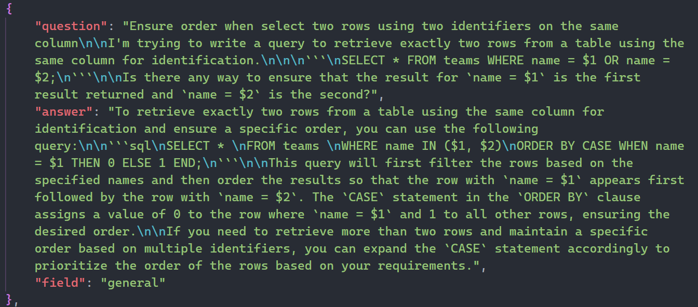
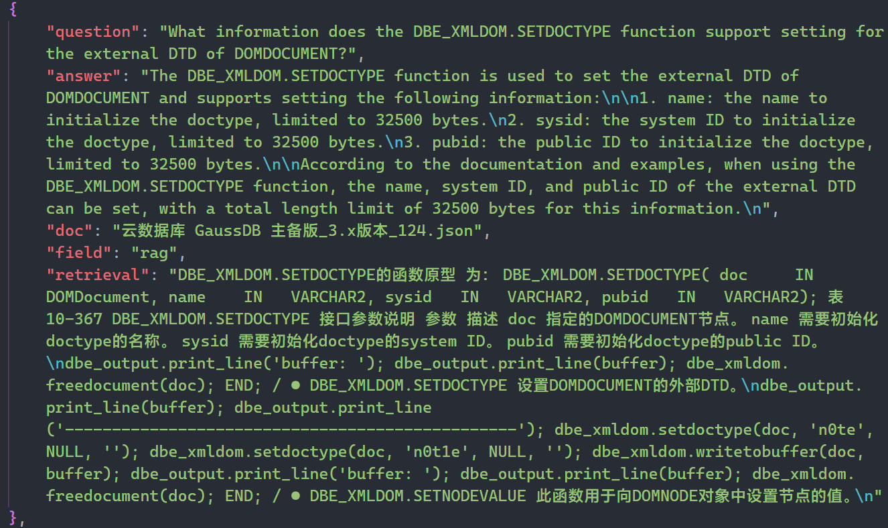
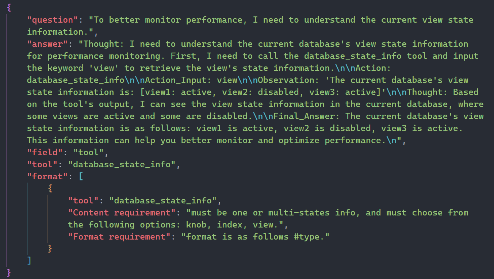

<div align='center'>
    <h1>Dataset of Benchmark DQA</h1>
</div>

<p align='center'>
    【English | <a href="README_zh.md">中文</a>】
</p>

## Contents

* [Overview](#1-overview)
* [Download Link](#2-download-link)
* [Directory Structure](#3-directory-structure)
* [Data Example](#4-data-example)

## 1. Overview

This section shows the DQA dataset, which is constructed by collecting Internet data and an innovative method based on large language model generation. The dataset contains more than 240,000 Chinese-English question-answer pairs, covering almost all aspects of database knowledge. This directory provides data examples and download links for the complete dataset.

## 2. Download Link

This repository only displays part of the data. For the complete dataset, please go to [Dataset of Benchmark DQA](https://drive.google.com/file/d/1pOn2-HdB4exaHT2Yh0nxZzy-8B1cuvQL/view?usp=drive_link) to download.

## 3. Directory Structure
```shell
Dataset_of_Benchmark_DQA
├─EN
│  ├─general_knowledge
│  │  ├─multiple_choice
│  │  └─forum_QA
│  ├─specific_instance
│  │  │  tools.json
│  │  ├─scenarios-based
│  │  └─tool-based
│  └─specific_product
│      ├─GaussDB
│      └─openGauss
├─ZH
│   ├─general_knowledge
│   │  ├─multiple_choice
│   │  └─forum_QA
│   ├─specific_instance
│   │  │  tools.json
│   │  ├─scenarios-based
│   │  └─tool-based
│   └─specific_product
│      ├─GaussDB
│      └─openGauss
└─general_knowledge_with_tags

```

Each directory under the EN and ZH directories contains three files: `train.json`, `test.json`, `validation.json`, with a data ratio of `9:0.5:0.5`.

## 4. Data Example

### General Knowledge

<div align="center">

</div>

### Specific Product

<div align="center">

</div>

### Specific Instance

<div align="center">

</div>
