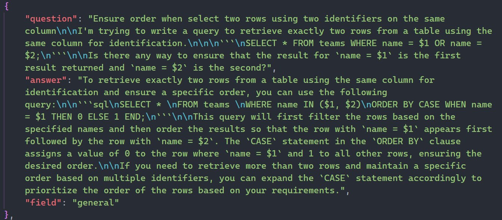
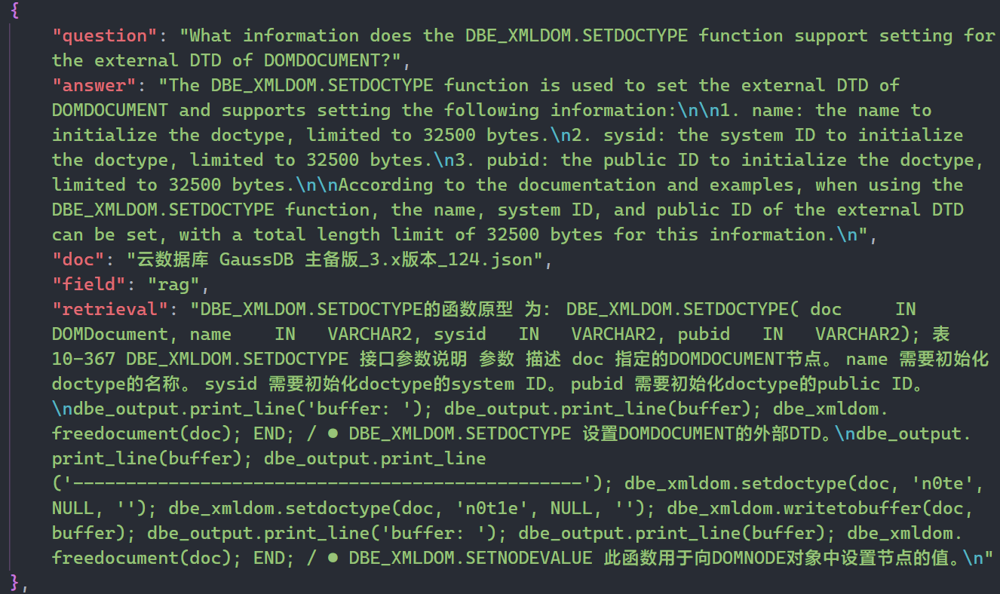
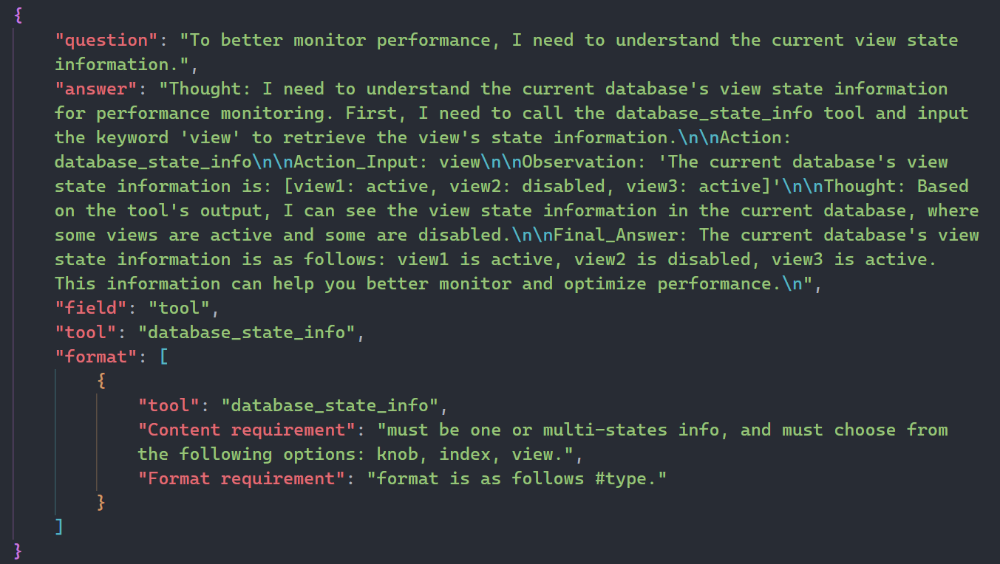

<div align='center'>
    <h1>Dataset of Benchmark DQA</h1>
</div>

<p align='center'>
    【<a href="README.md">English</a> | 中文】
</p>

## 目录

* [概述](#1-概述)
* [下载地址](#2-下载地址)
* [目录结构](#3-目录结构)
* [数据示例](#4-数据示例)

## 1. 概述

该部分展示了 DQA 的数据集，其构建采用了互联网数据采集和创新的基于大型语言模型生成的方法。该数据集包含了超过240,000对中英文问答对，覆盖了数据库知识的几乎所有方面。本目录提供了数据示例和完整数据集下载链接等内容。

## 2. 下载地址

本仓库只展示部分数据，完整数据集请前往 [Dataset of Benchmark DQA](https://drive.google.com/file/d/1pOn2-HdB4exaHT2Yh0nxZzy-8B1cuvQL/view?usp=drive_link) 下载。

## 3. 目录结构
```shell
Dataset_of_Benchmark_DQA
├─EN
│  ├─general_knowledge
│  │  ├─multiple_choice
│  │  └─forum_QA
│  ├─specific_instance
│  │  │  tools.json
│  │  ├─scenarios-based
│  │  └─tool-based
│  └─specific_product
│      ├─GaussDB
│      └─openGauss
└─ZH
    ├─general_knowledge
    │  ├─multiple_choice
    │  └─forum_QA
    ├─multiple_choice
    ├─specific_instance
    │  │  tools.json
    │  ├─scenarios-based
    │  └─tool-based
    └─specific_product
        ├─GaussDB
        └─openGauss

```

每个目录下均有 `train.json`, `test.json`, `validation.json` 三个文件，数据比例为`9:0.5:0.5`。


## 4. 数据示例

### General Knowledge

<div align="center">

</div>

### Specific Product

<div align="center">

</div>

### Specific Instance

<div align="center">

</div>
