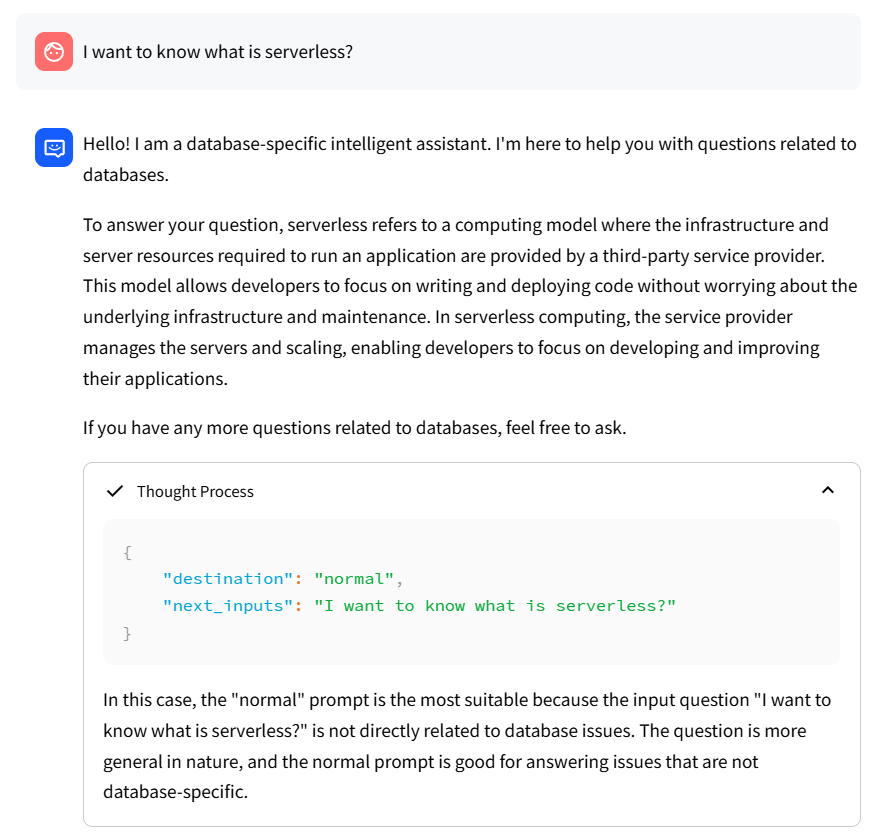
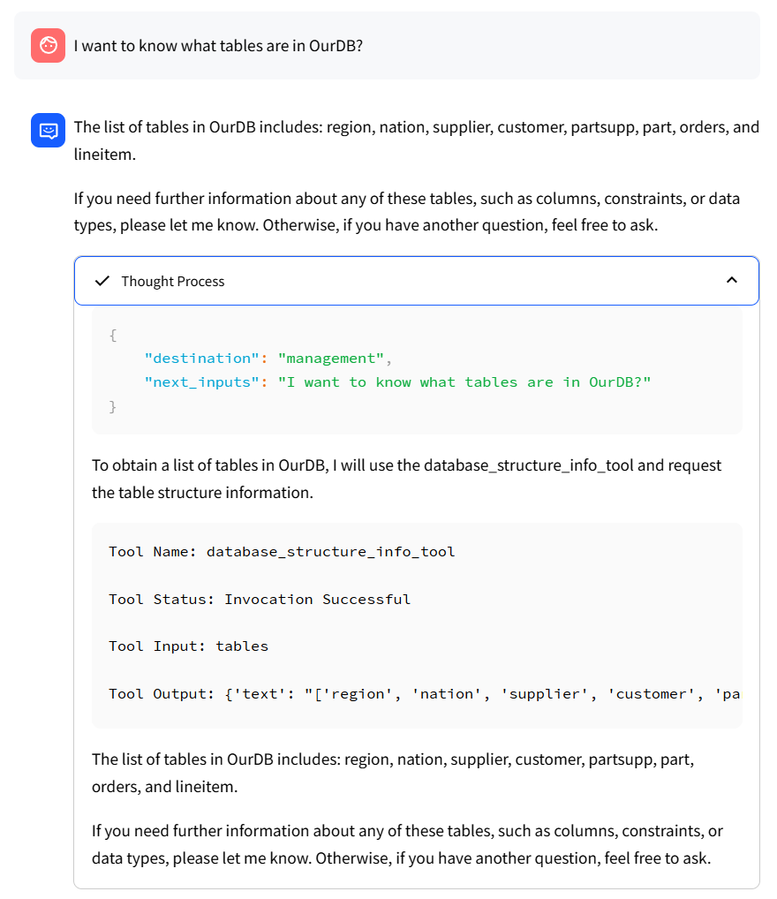

<div align='center'>
    <h1>Testbed BackBone</h1>
</div>

<p align='center'>
    【English | <a href="README_zh.md">中文</a>】
</p>

## Contents

* [Overview](#1-overview)
* [Environment Setup](#2-environment-setup)
* [Download Model](#3-download-model)
* [Initialize Knowledge Base and Configuration Files](#4-initialize-knowledge-base-and-configuration-files)
* [One-click Start](#5-one-click-start)
* [Main Page and Q&A Example](#6-main-page-and-qa-example)
* [Relevant Projects](#7-relevant-projects)

## 1. Overview

Based on Langchain-Chatchat, we have written a specific implementation and demonstration of automatic classification and answering of database questions, including General Knowledge, Specific Product and Specific Instance. This directory contains the complete code implementation and usage.

## 2. Environment Setup

2.1 First, ensure that your machine has Python 3.9 installed.
```shell
$ python --version
Python 3.9.19
```

2.2 Next, create a virtual environment and install the dependencies for the project within it.
```shell
# Clone the repository
$ git clone ......

# Enter the directory
$ cd DQA-Bench/2_Testbed_Demo/Testbed_BackBone

# Install all dependencies
$ pip install -r requirements_lite.txt 
$ pip install -r requirements_api.txt
$ pip install -r requirements_webui.txt  

# The default dependency uses the FAISS vector library to store the knowledge base and is based on the PostgreSQL database instance. If you want to use vector libraries such as milvus-pg_vector and other database instances, please add or uncomment the corresponding dependency and then install it.
```

## 3. Download Model

If you need to run this project locally or in an offline environment, you first need to download the required model locally. Usually, open source LLM and Embedding models can be downloaded from [HuggingFace](https://huggingface.co/models).

Take the conversation model [baichuan-inc/Baichuan2-13B-Chat](https://huggingface.co/baichuan-inc/Baichuan2-13B-Chat) and the Embedding model [BAAI/bge-large-zh](https://huggingface.co/BAAI/bge-large-zh) as examples:

To download the model, you need to first [install Git LFS](https://docs.github.com/zh/repositories/working-with-files/managing-large-files/installing-git-large-file-storage) and then run

```Shell
$ git lfs install
$ git clone https://huggingface.co/baichuan-inc/Baichuan2-13B-Chat
$ git clone https://huggingface.co/BAAI/bge-large-zh
```

## 4. Initialize Knowledge Base and Configuration Files

4.1 Configuration Files

The configuration files are in the configs/ directory. The following are the functions and necessary settings of each file.


- basic_config.py 

  This file is a basic configuration file and does not need to be modified.

- database_config.py 

  This file is a database configuration file and needs to be modified according to your own database instance information. This project takes PostgreSQL as an example.

- kb_config.py 

  This file is the knowledge base configuration file. You can modify DEFAULT_VS_TYPE to specify the storage vector library of the knowledge base, etc., and you can also modify the related paths.

- model_config.py 
  
  This file is a model configuration file that can specify the model and path to be used.

    ```shell
    MODEL_ROOT_PATH  # Total directory of all local models (can be empty)
    EMBEDDING_MODEL  # Specified Embedding model
    LLM_MODELS       # The specified dialogue model is presented in a list. To add a model, add it to the list now and then specify the model path.

    # Online model configuration (taking openai as an example)

    Configure in ONLINE_LLM_MODEL
    "openai-api": {
        "model_name": "",  # example gpt-3.5-turbo
        "api_base_url": "https://api.openai.com/v1",
        "api_key": "", # your api_key here
        "openai_proxy": ""
    }

    # Local model configuration

    Modify the property value in MODEL_PATH to specify the local model storage location. Three setting methods are supported:
    1、Change the corresponding value to the absolute path of the model
    2、Do not modify the value here (using text2vec as an example):
        2.1 If any of the following subdirectories exist under {MODEL_ROOT_PATH}:
            - text2vec
            - GanymedeNil/text2vec-large-chinese
            - text2vec-large-chinese
        2.2 If the above local path does not exist, the huggingface model is used
    ```

- prompt_config.py 
  
  This file is a configuration file of prompt, which is mainly used to customize prompts for different types of questions in the database.

- server_config.py 
  
  This file is a service configuration file, which mainly contains the service port number, etc. If the port number conflicts, it can be modified in this file. If you want to use other models, you need to add or cancel the corresponding comments in this file.

4.2 Initialize the knowledge base
```shell
$ python init_database.py --recreate-vs
 ```

## 5. One-click Start

Start the project with the following commands.
```shell
$ python startup.py -a
```

## 6. Main Page and Q&A Example

6.1 Main Page


6.2 Example of Conversation

- General Knowledge:

<div align="center">

</div>

- Specific Product：

<div align="center">

</div>

- Specific Instance：

<div align="center">

</div>

## 7. Relevant Projects

https://github.com/chatchat-space/Langchain-Chatchat
