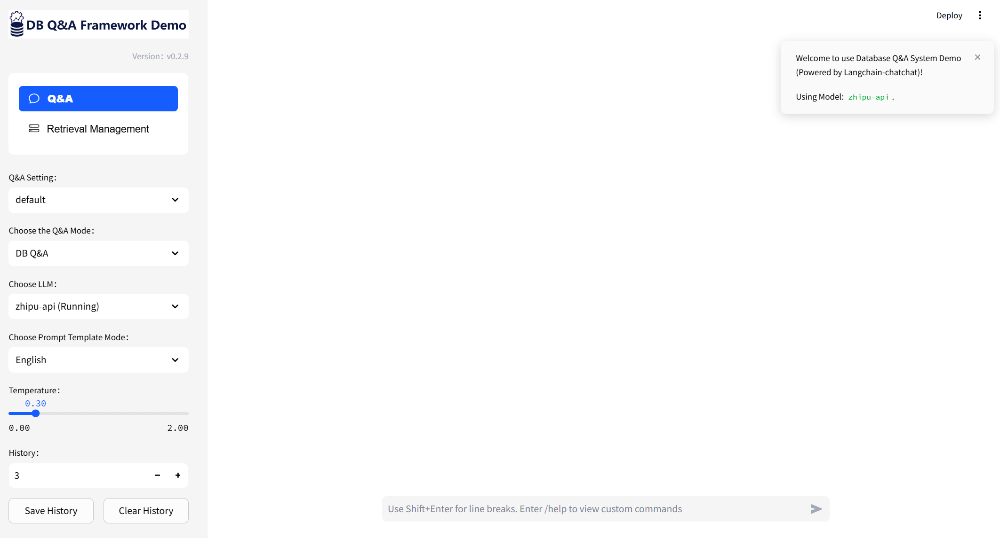
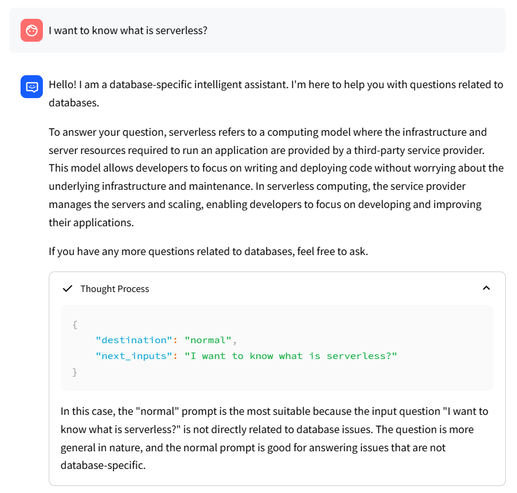
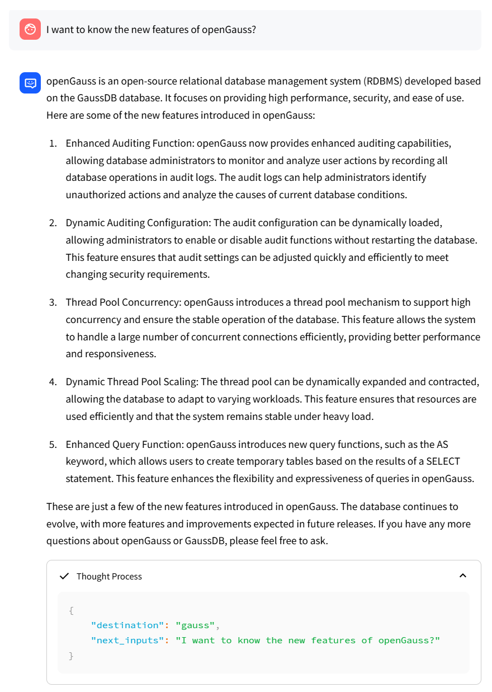
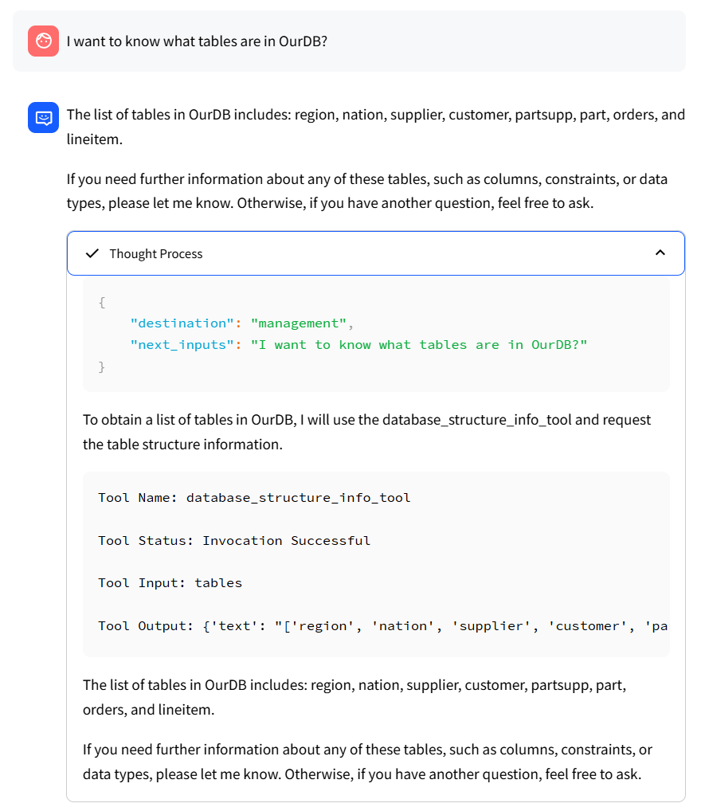

<div align='center'>
    <h1>Testbed BackBone</h1>
</div>

<p align='center'>
    【<a href="README.md">English</a> | 中文】
</p>

## 目录

* [概述](#1-概述)
* [环境配置](#2-环境配置)
* [模型下载](#3-模型下载)
* [修改配置文件并初始化知识库](#4-修改配置文件并初始化知识库)
* [一键启动](#5-一键启动)
* [主页面及问答示例](#6-主页面及问答示例)
* [相关项目](#7-相关项目)

## 1. 概述

我们基于Langchain-Chatchat，编写了对数据库问题自动分类和解答的具体实现和演示，包括General Knowledge，Specific Product 和 Specific Instance 等类别。本目录包含了完整的代码实现和使用方法。

## 2. 环境配置

2.1 首先，确保你的机器安装了 Python 3.9
```shell
$ python --version
Python 3.9.19
```

2.2 接着，创建一个虚拟环境，并在虚拟环境内安装项目的依赖
```shell
# 拉取仓库
$ git clone ......

# 进入目录
$ cd DQA-Bench/2_Testbed_Demo/Testbed_BackBone

# 安装全部依赖
$ pip install -r requirements_lite.txt 
$ pip install -r requirements_api.txt
$ pip install -r requirements_webui.txt  

# 默认依赖采用FAISS向量库存储知识库，并基于PostgreSQL数据库实例。如果要使用 milvus/pg_vector 等向量库以及其他数据库实例，请在 requirements.txt 中添加或取消相应注释再安装。
```

## 3. 模型下载

如果您需要在本地或离线环境中运行此项目，您首先需要将所需的模型下载到本地，通常开源 LLM 与 Embedding 模型可以从 [HuggingFace](https://huggingface.co/models) 下载。

以对话模型[baichuan-inc/Baichuan2-13B-Chat](https://huggingface.co/baichuan-inc/Baichuan2-13B-Chat) 与 Embedding 模型 [BAAI/bge-large-zh](https://huggingface.co/BAAI/bge-large-zh) 为例：

下载模型需要先[安装 Git LFS](https://docs.github.com/zh/repositories/working-with-files/managing-large-files/installing-git-large-file-storage)，然后运行

```Shell
$ git lfs install
$ git clone https://huggingface.co/baichuan-inc/Baichuan2-13B-Chat
$ git clone https://huggingface.co/BAAI/bge-large-zh
```

## 4. 修改配置文件并初始化知识库

4.1 配置文件

配置文件在 configs/ 目录下，以下是每个文件的功能及必要设置。


- basic_config.py 

  该文件是基础配置文件，不需要修改

- database_config.py 

  该文件是数据库配置文件，需要根据自己的数据库实例信息修改。本项目以PostgreSQL为例。

- kb_config.py 

  该文件是知识库配置文件，可以修改DEFAULT_VS_TYPE来指定知识库的存储向量库等，也可以修改修改相关的路径。

- model_config.py 
  
  该文件是模型配置文件，可以指定使用的模型及路径等。

    ```shell
    MODEL_ROOT_PATH  # 所有本地模型的总目录（可以为空）
    EMBEDDING_MODEL  # 指定的 Embedding 模型
    LLM_MODELS       # 指定的对话模型，以列表形式呈现，，若要添加模型，请现在列表中添加，然后在指定模型路径

    # 在线模型配置（以openai为例)

    在 ONLINE_LLM_MODEL 中配置
    "openai-api": {
        "model_name": "",  # example gpt-3.5-turbo
        "api_base_url": "https://api.openai.com/v1",
        "api_key": "", # your api_key here
        "openai_proxy": ""
    }

    # 本地模型配置

    在 MODEL_PATH 中修改属性值，以指定本地模型存储位置。支持3种设置方法：
    1、将对应的值修改为模型绝对路径
    2、不修改此处的值（以 text2vec 为例）：
        2.1 如果 {MODEL_ROOT_PATH} 下存在如下任一子目录：
            - text2vec
            - GanymedeNil/text2vec-large-chinese
            - text2vec-large-chinese
        2.2 如果以上本地路径不存在，则使用 huggingface 模型
    ```

- prompt_config.py 
  
  该文件是prompt配置文件，主要是针对数据库中不同种类问题的定制化prompt。

- server_config.py 
  
  该文件是服务配置文件，主要是服务的端口号等，如果端口号冲突可以在该文件中修改。如果要使用其他模型，需要在该文件中添加或取消相应注释。

4.2 初始化知识库
```shell
$ python init_database.py --recreate-vs
 ```

## 5. 一键启动

按照以下命令启动项目
```shell
$ python startup.py -a
```

## 6. 主页面及问答示例

6.1 主页面



6.2 对话示例

- 通用数据库知识问答:

<div align="center">

</div>

- 特定数据库产品问答：

<div align="center">

</div>

- 特定数据库实例问答：

<div align="center">

</div>

## 7. 相关项目

https://github.com/chatchat-space/Langchain-Chatchat
