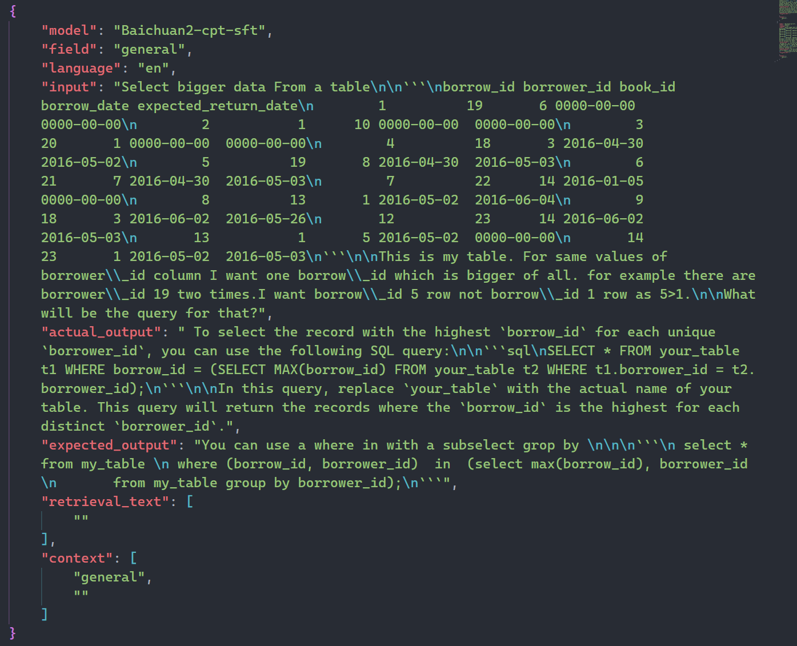
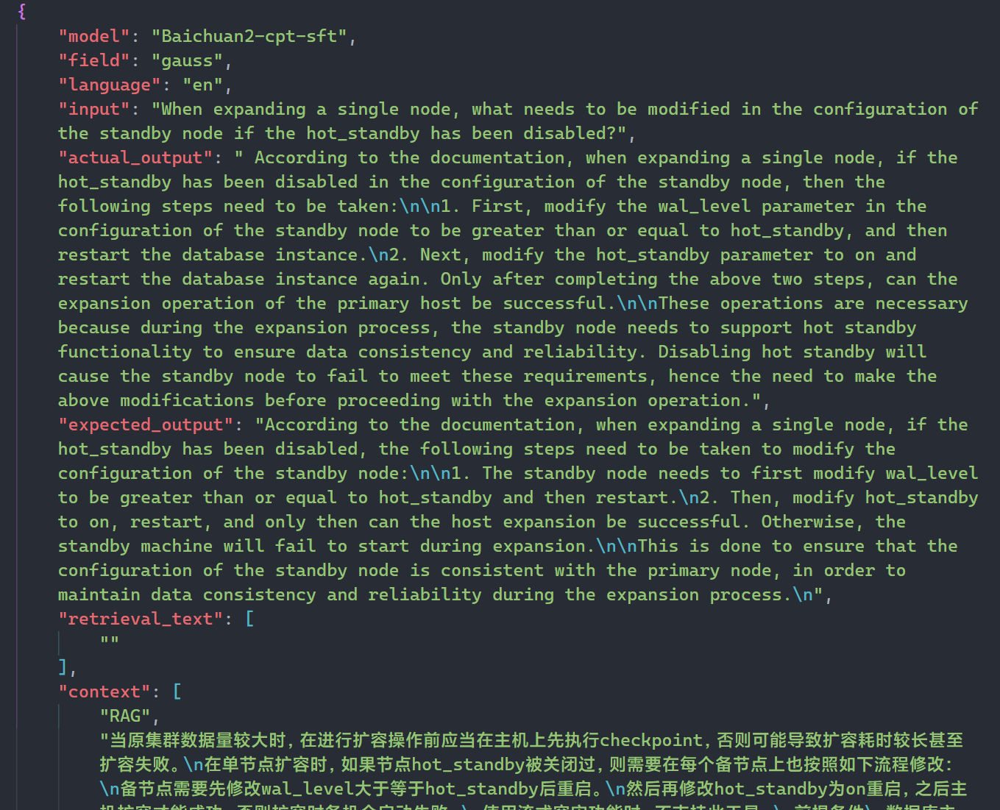
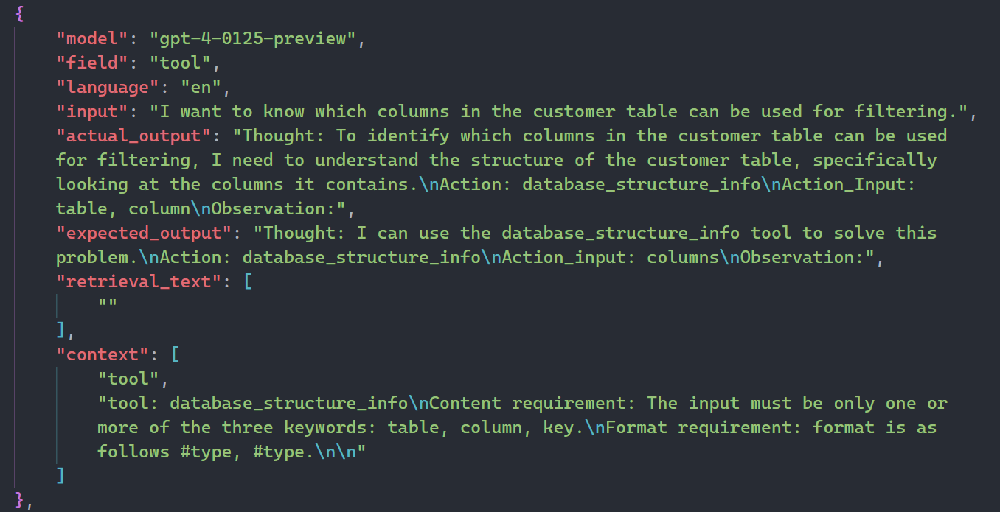

<div align='center'>
    <h1>Popular LLMs Response for DQA</h1>
</div>

<p align='center'>
    【English | <a href="README_zh.md">中文</a>】
</p>

## Contents

* [Overview](#1-overview)
* [Download Link](#2-download-link)
* [Directory Structure](#3-directory-structure)
* [Data composition](#4-data-composition)
* [Data Example](#5-data-example)

## 1. Overview

This section shows the response of multiple popular large language models on DQA. By testing this response dataset, we can comprehensively evaluate the performance of different LLMs in database question answering tasks. This directory contains model response examples and download links for the complete response dataset. It is divided into two sub-directories in Chinese and English, each of which contains three parts: General Knowledge, Specific Product, and Specific Instance.

## 2. Download Link

This repository only displays part of the data. For the complete dataset, please go to [Popular LLMs Response for DQA](https://drive.google.com/file/d/1ZN67vh1smrYG1TYzZPNSUql2b7KJD0oJ/view?usp=drive_link) to download.

## 3. Directory Structure
```shell
Popular_LLMs_Response_for_DQA
├─EN
│  ├─general_knowledge
│  ├─specific_instance
│  └─specific_product
│      ├─without_prompt
│      └─with_prompt
└─ZH
    ├─general_knowledge
    ├─specific_instance
    └─specific_product
        ├─without_prompt
        └─with_prompt
```

## 4. Data composition

| Model              | General Knowledge | Specific Product  | Specific Instance | Link |
| :----------------: | :---------------: | :---------------: | :---------------: | :---------------: |
| Baichuan2-13B-Chat |         √         |         √         |         √         | https://huggingface.co/baichuan-inc/Baichuan2-13B-Chat |
| Baichuan2-cpt-sft  |         √         |         √         |         √         | \ |
| Baichuan2-sft      |         √         |         √         |         √         | \ |
| glm-3-turbo        |         √         |         √         |         √         | https://open.bigmodel.cn/ |
| gpt-3.5-turbo      |         √         |         √         |         √         | https://openai.com/ |
| gpt-4              |         √         |         √         |         √         | https://openai.com/ |
| Llama2-13B-Chat    |         √         |         √         |         ×         | https://huggingface.co/meta-llama/Llama-2-13b-chat-hf |
| Llama3-8B-Instruct |         √         |         √         |         √         | https://huggingface.co/meta-llama/Meta-Llama-3-8B-Instruct |
| Yuan-2B            |         √         |         √         |         ×         | https://huggingface.co/IEITYuan/Yuan2-2B-Februa-hf |


## 5. Data Example

### General Knowledge

<div align="center">

</div>

### Specific Product

<div align="center">

</div>

### Specific Instance

<div align="center">

</div>
