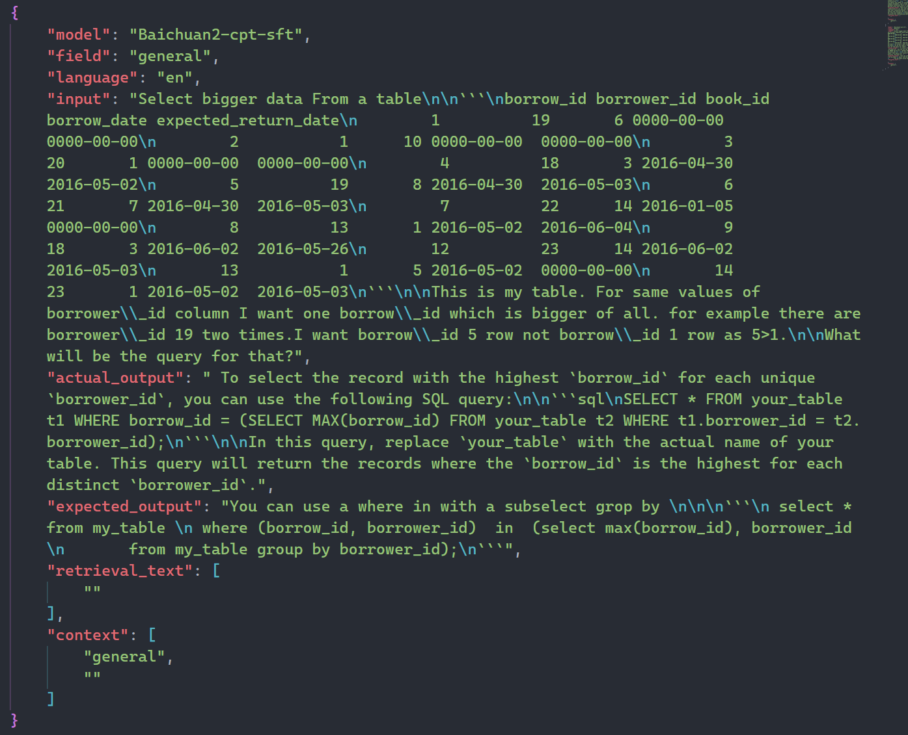
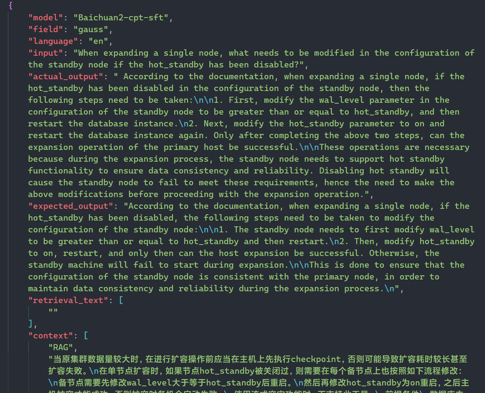
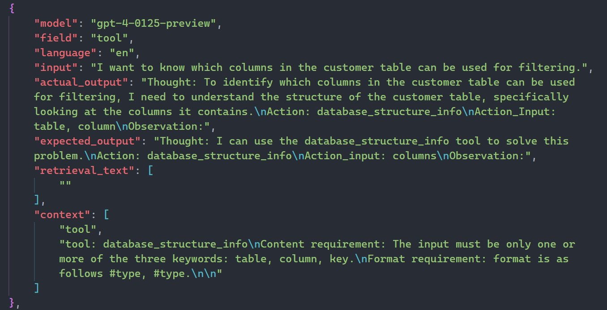

<div align='center'>
    <h1>Popular LLMs Response for DQA</h1>
</div>

<p align='center'>
    【<a href="README.md">English</a> | 中文】
</p>

## 目录

* [概述](#1-概述)
* [下载地址](#2-下载地址)
* [目录结构](#3-目录结构)
* [数据组成](#4-数据组成)
* [数据示例](#5-数据示例)

## 1. 概述

这部分内容展示了多个主流的大型语言模型在 DQA 上的回答。通过对该回答数据集的测试，可以全面评估不同 LLM 在数据库问答任务中的表现。该目录包含模型回答示例和完整回答数据集下载链接等内容，分为中英两个子目录，每个分别包含General Knowledge，Specific Product，Specific Instance三个部分。

## 2. 下载地址

本仓库只展示部分数据，完整数据集请前往 [Popular LLMs Response for DQA](https://drive.google.com/file/d/1ZN67vh1smrYG1TYzZPNSUql2b7KJD0oJ/view?usp=drive_link) 下载

## 3. 目录结构
```shell
Popular_LLMs_Response_for_DQA
├─EN
│  ├─general_knowledge
│  ├─specific_instance
│  └─specific_product
│      ├─without_prompt
│      └─with_prompt
└─ZH
    ├─general_knowledge
    ├─specific_instance
    └─specific_product
        ├─without_prompt
        └─with_prompt
```

## 4. 数据组成

| Model              | General Knowledge | Specific Product  | Specific Instance | Link |
| :----------------: | :---------------: | :---------------: | :---------------: | :---------------: |
| Baichuan2-13B-Chat |         √         |         √         |         √         | https://huggingface.co/baichuan-inc/Baichuan2-13B-Chat |
| Baichuan2-cpt-sft  |         √         |         √         |         √         | \ |
| Baichuan2-sft      |         √         |         √         |         √         | \ |
| glm-3-turbo        |         √         |         √         |         √         | https://open.bigmodel.cn/ |
| gpt-3.5-turbo      |         √         |         √         |         √         | https://openai.com/ |
| gpt-4              |         √         |         √         |         √         | https://openai.com/ |
| Llama2-13B-Chat    |         √         |         √         |         ×         | https://huggingface.co/meta-llama/Llama-2-13b-chat-hf |
| Llama3-8B-Instruct |         √         |         √         |         √         | https://huggingface.co/meta-llama/Meta-Llama-3-8B-Instruct |
| Yuan-2B            |         √         |         √         |         ×         | https://huggingface.co/IEITYuan/Yuan2-2B-Februa-hf |


## 5. 数据示例

### General Knowledge

<div align="center">

</div>

### Specific Product

<div align="center">

</div>

### Specific Instance

<div align="center">

</div>
