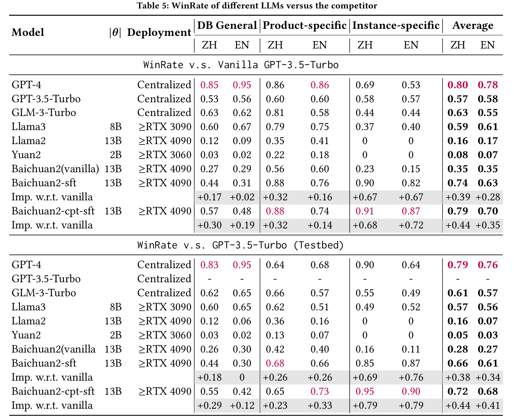
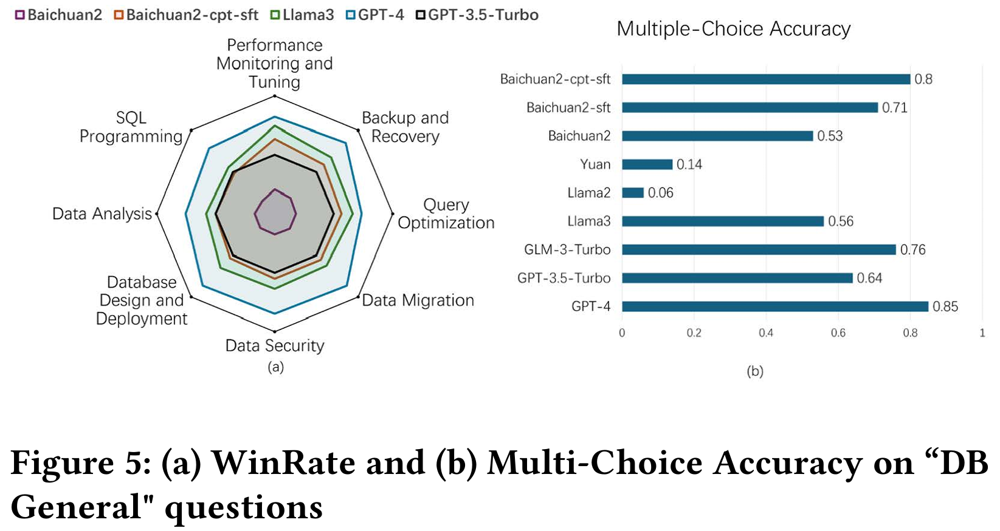
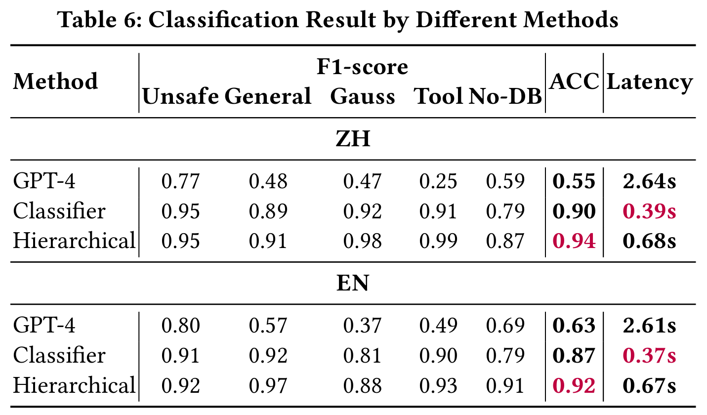
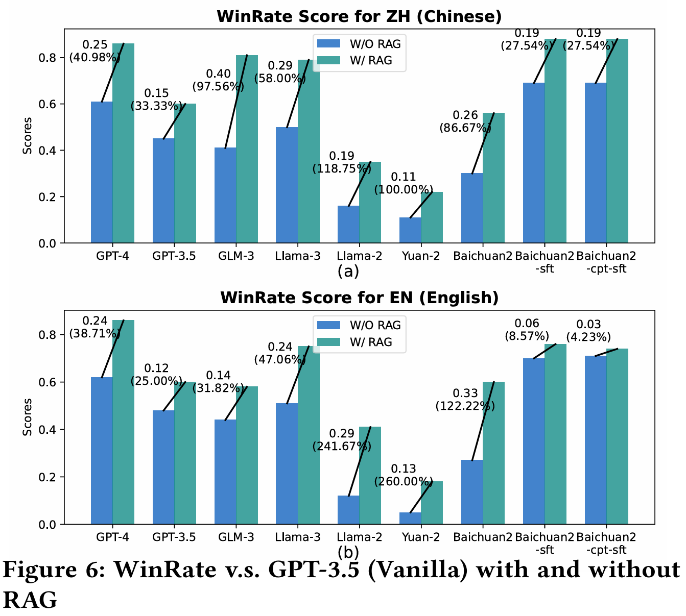
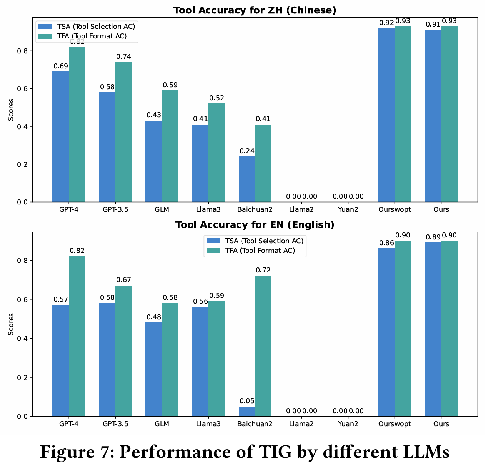

    <h1>Experimental Results on DQA</h1>

## Overview

This section presents the experimental results on DQA, including the question classification results of different methods and the answer evaluation results of different models, revealing their advantages and disadvantages.

## WinRate of different LLMs versus the competitor

## WinRate and Multi-Choice Accuracy on "DB General" questions

## Classification Result by Different Methods

## WinRate v.s. GPT-3.5 (Vanilla) with and without RAG

## Performance of TIG by different LLMs

